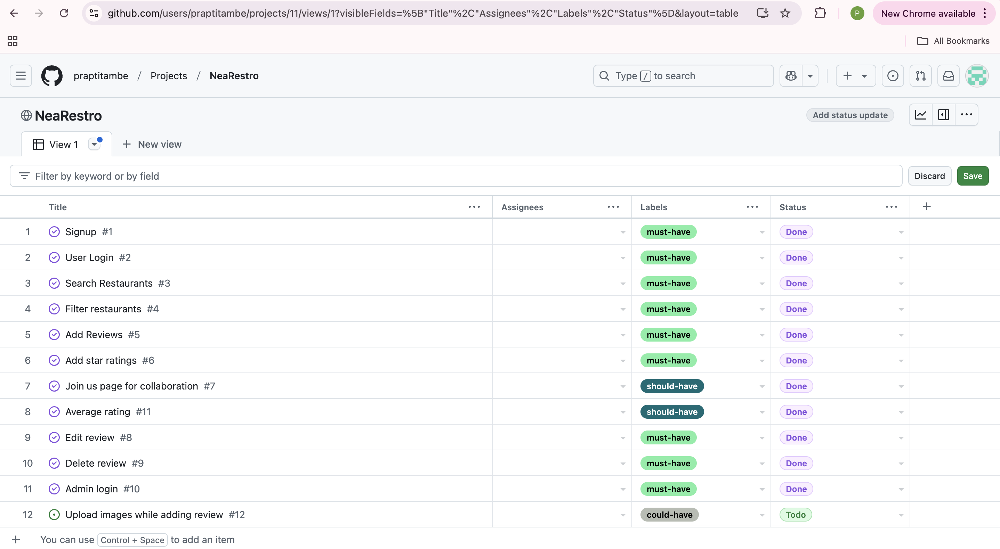
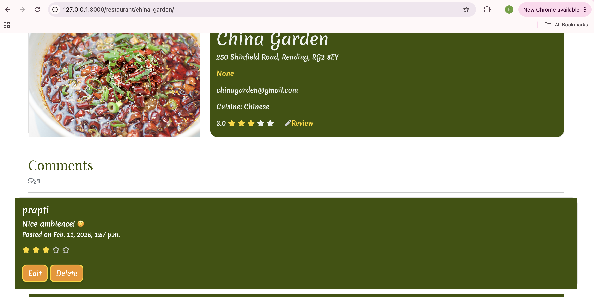
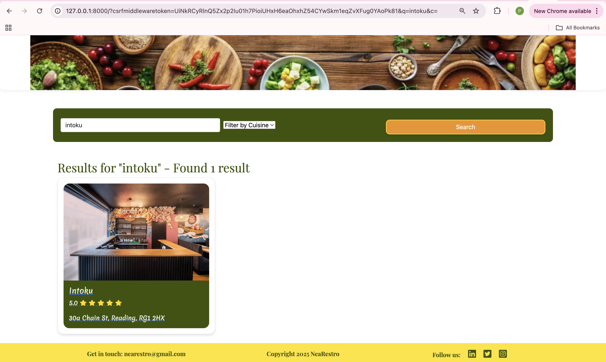

# NeaRestro

## Overview

NeaRestro is a web application designed to help users discover restaurants in their city based on their preferred cuisine. 
It is built with Django and styled using Bootstrap 5. It is my final project for 16 week's Full Stack Development for the AI Augmented Developer Bootcamp course at Code Institute. It offers a seamless user experience with full CRUD functionality, allowing users to effortlessly create, read, update and delete their comments. Additionally user can search restaurants by applying cuisine filter.
The platform aims to provide a seamless and user-friendly experience for food enthusiasts looking to explore new dining options. 

[Live View](https://nearestro-0ab3008aa139.herokuapp.com/)

## Responsive
NeaRestro is fully responsive, ensuring a seamless experience across various devices, including desktops, tablets, and mobile phones. 
The design adapts to different screen sizes, providing an optimal viewing experience whether you're at home or on the go.

### Purpose

The primary purpose of NeaRestro is to connect users with a variety of restaurants in their city, categorized by different cuisines. Whether you are craving Italian, Chinese, Indian, or any other type of cuisine, NeaRestro makes it easy to find the perfect restaurant to satisfy your taste buds. Additionally, NeaRestro provides comments and rating-based suggestions, allowing users to make informed decisions based on the experiences and feedback of other diners.

### Problem It Solves

Finding a restaurant that serves your favorite cuisine can be a daunting task, especially in a large city with numerous dining options. NeaRestro addresses this problem by providing a centralized platform where users can search for restaurants based on cuisine type, location, and other relevant criteria. This eliminates the need for users to browse through multiple websites or rely on word-of-mouth recommendations. Additionally, NeaRestro includes user-generated comments and ratings, offering valuable insights and suggestions to help users choose the best restaurants based on the experiences of others.

### Value to Users

- **Convenience**: Users can quickly and easily find restaurants that match their culinary preferences without having to sift through unrelated options.
- **Variety**: NeaRestro offers a diverse range of cuisines, ensuring that users can find something to suit their tastes, no matter how specific.
- **User Reviews and Ratings**: The platform includes user-generated reviews and ratings, helping users make informed decisions based on the experiences of others. Users can read comments and see ratings for each restaurant, providing valuable insights into the quality of food and service.
- **Informed Choices**: By considering the comments and ratings of other users, individuals can make better-informed decisions when choosing a restaurant, ensuring a more satisfying dining experience.
- **User Interaction**: Users can add, delete, or update their own comments, allowing them to share their experiences and feedback with the community.
- **Detailed Information**: Each restaurant listing includes essential details such as address, contact information, and a brief description, making it easy for users to plan their visit.

NeaRestro is the go-to platform for anyone looking to explore the culinary landscape of their city, offering a comprehensive and enjoyable experience for food lovers everywhere.

## User Expereince (UX)

Throughout the development of Yummy Tummy, **Agile methodology** was employed to ensure iterative progress and continuous improvement. 
This approach facilitated regular feedback and allowed for adaptive planning, ultimately leading to a more refined and user-centric application.

### User Goals

Users want a platform that:
- Provides a wide variety of restaurants to explore.
- Allows easy categorization and search of restaurants by name or city and filter by cuisine.
- Includes user reviews and ratings to help in selecting restaurants.
- Easy navigation

### Site Owner Goals

The site owner aims to:
- Create a comprehensive and user-friendly restaurant review platform.
- Encourage user engagement through interactive features like comments and ratings.
- Continuously update the recipe database with new and diverse recipes.
- Maintain a high standard of UX/UI design to enhance user satisfaction.

### Agile 
- Agile methodology is "a set of methods and practices where solutions evolve through collaboration between self-organising, cross-functional teams"
- A project board was set-up to keep track of user stories. Each user story was assigned a 'MoSCoW' prioritisation (must have, should have, could have, won't have) tag. 

#### MoSCoW Tecnhique
The MoSCoW technique is a prioritization method used to decide which features to implement in a project. It stands for:

- **Must-Have**: These are the essential features that the project cannot do without. They are critical for the application's functionality and must be included in the initial release.
- **Should-Have**: These features are important but not critical. They add significant value to the project and should be included if possible, but the project can still function without them.
- **Could-Have**: These are desirable features that can enhance the user experience but are not essential. They can be considered for future updates if time and resources permit.
- **Won't-Have**: These features are the least critical and will not be included in the current project scope. They may be revisited in future iterations.

By using the MoSCoW technique, I was able to focus on delivering the most critical features first, ensuring a functional and valuable application for users while planning for future enhancements.
I have implemented all Must-have and Should-have features. Could-have are for future implementations.

- **Link to User Stories in GitHub Projects:**
  - [GitHub Projects kanban board](https://github.com/users/praptitambe/projects/11/views/1)

## UX Design Process

## Design

### Wireframes

The wireframes for NeaRestro were created using Balsamiq to create clear, visual layouts of the site's design. While the initial designs provided a solid foundation, some elements evolved during development to enhance the overall user experience. These changes, though different from the original wireframes, resulted in a more polished and user-friendly application.

- Wireframes were created with Balsamiq to create clear, visual layouts of the site's design. It helped in identifying potential issues and refining the user interface early on, ensuring a more seamless user experience.
 - The wireframes were developed at the start of the project and then worked on as I went through, to tweak the changes I made to the design and feel of the site

### Logo
The logo for NeaRestro was created by me, reflecting the essence of the application. Here are some key points about the logo:

- **Design Concept**: The logo combines elements of cutlery to visually represent the application's focus on food.
- **Color Scheme**: The colors used in the logo align with the overall color palette of the application, ensuring a cohesive visual identity.
- **Typography**: The font used in the logo is clean and modern, making it easily readable and visually appealing.
- **Scalability**: The logo is designed to be scalable, ensuring it looks great on various devices and screen sizes, from mobile phones to desktops.

- [logo](static/images/logo.png)

### Color Palette

- [Color Palette](https://colorhunt.co/palette/3d5300abba7cffe31af09319)

- #FFE31A - Navigation and footer background.
- #3D5300 - Background of cards and forms.
- #F09319 - Button color, text color on login,logout and signup form.
- #ABBA7C - Button color when hovered.
- #F5F2F2 - Text color.

### Typography 

[Google fonts](https://fonts.google.com/selection)
 - Heading -  'Playfair Display', serif
 - Body - 'Merienda', serif

## Key Features

- **Restaurant Search by Cuisine and Location**: Users can search for restaurants based on their preferred cuisine and location. This feature allows users to quickly find restaurants that match their culinary preferences.

- **User Reviews and Ratings**: Users can read reviews and ratings left by other diners. This feature helps users make informed decisions based on the experiences of others.

- **Add, Delete, and Update Comments**: Authenticated users can add, delete, and update their own comments on restaurant listings. This feature allows users to share their dining experiences and provide feedback.

- **Detailed Restaurant Information**: Each restaurant listing includes essential details such as address, contact information, cuisine type, a brief description, comments and average rating based on number of reviews. This feature provides users with all the necessary information to plan their visit.

- **Responsive Design**: The platform is designed to be responsive, ensuring a seamless user experience across different devices, including desktops, tablets, and mobile phones.

- **User Authentication**: Users can create accounts, log in, and manage their profiles. This feature ensures that only authenticated users can add, delete, or update comments.

- **Admin Panel**: An admin panel is available for managing restaurant listings, user comments, and other administrative tasks. This feature allows administrators to maintain the quality and accuracy of the information on the platform.

- **Search Restaurants**: When users input city or restaurant name in search bar with optional cousine type, the platform filtes restro suggestions based on the input. This feature helps users quickly find the restaurants they are looking for.

- **Accessibility Features**: The platform includes accessibility features such as high contrast mode, screen reader support, and keyboard navigation to ensure that it is usable by all users, including those with disabilities.

- **Social Media Integration**: Users can follow the platform on social media and share restaurant listings with their friends. This feature helps increase engagement and reach.

NeaRestro is designed to provide a comprehensive and enjoyable experience for food lovers, making it easy to discover and explore the culinary landscape of their city.

## Features
### Authentication

- **Sign-In**: Users can sign in to their accounts to access personalized features such as adding ratings and reviews.

- **Sign-In Success** : Once log-in, user will see success message.
 

- **Register**: New users can register for an account to start collaborating and sharing their recipes.

- **Sign-out** : In the header, if you are logged in, you can press the 'Logout' button which will take you to the sign-out page.
 

- **Sign-out success** : User will see sign-out message.

### Join Us

- **Collaborate to add restaurant** : Restaurant owner can add their restaurant to our website to reachout to more people in community and gain more customers.

- **Request submitted** : Once, you submit restaurant details, there will be a pop-up message which acknowledge the submission.

- **Write Reviews**: Users can write reviews and rate restaurants, helping others to choose the best restaurants.

- **Awaiting approval**: Users will receive apporoval awaiting text after adding their comment.

- **Comment Approved**: Admin will approve comment from dashboard.

- **Approved comment displayed**: Admin will approve comment from dashboard.

- **Comment Updated**: Users will be able to see their comments updated.

- **Delete Confirmation**: If a user wants to delets his comment, he can but a confirm message will pop up to ask him again to be sure.

- **Comment Deleted** : User will see commment deleted pop up.

- **Search Restaurant by name** : User will be able to search restaurant by name or city.

- **Searched result of Restaurant by name** : User will be able to see restaurant searched results 

- **Search Restaurant by name or city with filter cuisine** : User will be able to see results for restaurant searched.

### Admin panel Database

The database for Yummy Tummy is designed to efficiently manage and store user data, recipes, comments, and ratings. It uses PostgreSQL, a powerful, open-source relational database system, which ensures data integrity and supports complex queries.

## Database
I used Code Institute's PostgreSQL database.

### Database planning
I used an Entity Relationship Diagram to plan my database.

## Entity-Relationship Diagram (ERD)

The key entities and their relationships are as follows:

1. **User**
   - **Attributes**:
     - `id`: Unique identifier for the user (Primary Key)
     - `username`: The username of the user
     - `email`: The email address of the user
     - `password`: The password for the user's account
     - `date_joined`: The date and time when the user joined
   - **Relationships**:
     - A user can write multiple comments (One-to-Many relationship with the `Comment` entity)

2. **Cuisine**
   - **Attributes**:
     - `id`: Unique identifier for the cuisine (Primary Key)
     - `cuisine_type`: The type of cuisine (e.g., Italian, Chinese, Indian)
     - `description`: A brief description of the cuisine
   - **Relationships**:
     - A cuisine can be associated with multiple restaurants (One-to-Many relationship with the `Restaurant` entity)

3. **Restaurant**
   - **Attributes**:
     - `id`: Unique identifier for the restaurant (Primary Key)
     - `name`: The name of the restaurant
     - `slug`: A unique slug for the restaurant URL
     - `email`: The email address of the restaurant
     - `address_line1`: The first line of the restaurant's address
     - `address_line2`: The second line of the restaurant's address (optional)
     - `city`: The city where the restaurant is located
     - `postcode`: The postal code of the restaurant's location
     - `restro_image`: An image of the restaurant
     - `created_at`: The date and time when the restaurant was added
     - `status`: The status of the restaurant (e.g., Draft, Published)
   - **Relationships**:
     - A restaurant belongs to one cuisine (Many-to-One relationship with the `Cuisine` entity)
     - A restaurant can have multiple comments (One-to-Many relationship with the `Comment` entity)
     - A restaurant is added by one user (Many-to-One relationship with the `User` entity)

4. **Comment**
   - **Attributes**:
     - `id`: Unique identifier for the comment (Primary Key)
     - `comment`: The text of the comment
     - `is_approved`: A boolean indicating whether the comment is approved
     - `created_at`: The date and time when the comment was created
     - `rating`: The rating given by the user (optional)
   - **Relationships**:
     - A comment is written by one user (Many-to-One relationship with the `User` entity)
     - A comment is associated with one restaurant (Many-to-One relationship with the `Restaurant` entity)

### Relationships Summary
- **User to Comment**: One-to-Many (A user can write multiple comments)
- **Cuisine to Restaurant**: One-to-Many (A cuisine can be associated with multiple restaurants)
- **Restaurant to Comment**: One-to-Many (A restaurant can have multiple comments)
- **Restaurant to User**: Many-to-One (A restaurant is added by one user)
- **Comment to User**: Many-to-One (A comment is written by one user)
- **Comment to Restaurant**: Many-to-One (A comment is associated with one restaurant)

### How to create a database

1. Navigate to [PostgreSQL](https://dbs.ci-dbs.net/) from Code Institute.
2. Enter your student email address in the input field provided.
3. Click Submit.
4. Wait while the database is created.
5. Check your email.
6. You now have a URL you can use to connect your app to your database.

## Deployment
- The website was deployed to Heroku and can be found [here](https://nearestro-0ab3008aa139.herokuapp.com/)

### Heroku
- Heroku is a cloud platform that lets developers create, deploy, monitor and manage apps.
- You will need a Heroku log-in to be able to deploy a website to Heroku.
- Once you have logged into Heroku:

1. Click 'New' > 'Create new app'
2. Choose a unique name, choose your region and press 'Create app'
3. Click on 'Settings' and then 'Reveal Config Vars'
4. Add a key of 'DISABLE_COLLECTSTATIC' with a value of '1'.
5. Add a key of 'DATABASE_URL' - the value will be the URL you were emailed when creating your database.
6. Add a key of 'SECRET_KEY' - the value will be any random secret key (google 'secret key generator' and use it to generate a random string of numbers, letters and characters)
7. In your terminal, type the code you will need to install project requirements:
    - pip3 install gunicorn~=20.1
    - pip3 install -r requirements.txt
    - pip3 freeze --local > requirements.txt
8. Create an 'env.py' file at the root directory which contains the following:
    - import os
    - os.environ["DATABASE_URL"]='CI database URL'
    - os.environ["SECRET_KEY"]=" Your secret key"
9. Create a file at the root directory called Procfile. In this file enter: "web: gunicorn my_project.wsgi" (without the quotes)
10. In settings.py, set DEBUG to False. 
    - YOU SHOULD ALWAYS SET DEBUG TO FALSE BEFORE DEPLOYING FOR SECURITY
11. Add ",'.herokuapp.com' " (without the double quotes) to the ALLOWED_HOSTS list in settings.py
12. Add, commit and push your code.
13. Go back to Heroku, click on the 'Deploy' tab.
14. Connect your project to GitHub.
15. Scroll to the bottom and click 'Deploy Branch' and your project will be deployed!

## Technologies used

- HTML was used to structure the content of the website.
- CSS were used to design the layout of the website.
- Bootstrap was used as a CSS framework to provide a grid structure and improve responsiveness.
- Python and Django were used to build the backend review framework.
- GitHub was used to host the repository and version control.
- Heroku was the hosting platform.

## Testing Summary
## Testing
- Please see [TESTING.md](TESTING.md) file for all testing.

## AI Assistance in Development
During the development of NeaRestro, I used GitHub Copilot to assist in various parts of the process, enhancing both the speed and quality of the code:

-**Code Suggestions**: Copilot provided efficient and error-free code snippets and functions. It also helped in organizing the CSS and cleaning up classes, making the codebase more maintainable.

-**Debugging**: Encountering several bugs during development, Copilot quickly identified and resolved them. Its role in spotting and fixing errors significantly smoothed the development process.

-**Documentation**: AI tools aided in creating detailed documentation by generating markdown templates and offering content ideas for the website.

-**Design**: AI-based design tools suggested improvements for the UI/UX, resulting in a more polished and user-friendly application.

-**Productivity**: Copilot increased productivity by automating repetitive tasks and providing smart code suggestions. This allowed me to focus on the core features and design of the app, enhancing its overall functionality.

-**Reflection**: One of my proudest moments was refining the Bootstrap styling with Copilot's help. Initially lacking confidence in front-end design, AI suggested impactful changes like fixing button alignment and adjusting breakpoints. These improvements made the app look more professional and ensured full responsiveness, a key priority.

-**Overall Impact**: Working with Copilot improved my workflow, allowing me to focus on the big picture while efficiently handling repetitive tasks. Although some suggestions required tweaking, this experience highlighted AI as a valuable tool rather than a replacement for my skills.

This experience not only enhanced my technical skills but also improved my problem-solving abilities. It helped me articulate my ideas more clearly and increased my awareness of accessibility and inclusivity in software design. Most importantly, it demonstrated the value of new technologies as partners in the creative process.

## Future Enhancements

1. **Advanced Search Filters**: Implement advanced search filters to allow users to narrow down their search results based on additional criteria such as price range, distance, and dietary preferences (e.g., vegan, gluten-free).

2. **Interactive Map**: Add an interactive map feature that displays restaurant locations and allows users to see nearby dining options. The map could include filters for cuisine type and user ratings.

3. **User Profiles**: Enhance user profiles to include more detailed information, such as favorite restaurants, review history, and personalized recommendations based on past activity.

4. **Social Media Integration**: Improve social media integration by allowing users to share their reviews and favorite restaurants directly to their social media accounts. This could help increase engagement and attract new users.

5. **Multilingual Support**: Implement multilingual support to cater to a broader audience. This feature would allow users to view the platform in their preferred language.

6. **AI-Powered Recommendations**: Utilize AI to provide personalized restaurant recommendations based on user preferences, past reviews, and dining history. This feature could enhance the user experience by offering tailored suggestions.

7. **Enhanced Review System**: Improve the review system by allowing users to upload photos and videos with their reviews. This feature could provide more comprehensive insights into the dining experience.

8. **Reservation System**: Integrate a reservation system that allows users to book tables directly through the platform. This feature could include real-time availability and confirmation notifications.

By implementing these future enhancements, NeaRestro can continue to evolve and provide an even more valuable and engaging experience for its users.

## Credits

### Resources

- **Colorhunt**: For generating the color palette used in the application.
- **Am I Responsive**: For testing the responsiveness of the application across different devices.
- **Google Fonts**: For providing the fonts used in the application.
- **Logo Design**: Created using Logo Maker to reflect the essence of the application.
- **dbdiagram.io**: For creating the Entity Relationship Diagram (ERD) used in database planning.
- **Balsamiq**: For wireframe creation.
- **Heroku**: For hosting the application.
- **PostgreSQL**: For database management.
- **Unsplash & Chatgpt**: For providing high-quality images used in the application
- **Font Awesome**: For icons used throughout the site.

### Inspiration

- **Restaurant Review Websites**: Various restaurant review websites inspired the features and design of NeaRestro, aiming to create a user-friendly and engaging platform for food enthusiasts.
- **Community Feedback**: Conversations with friends and family revealed a common frustration with the lack of reliable and comprehensive restaurant discovery tools. Their feedback reinforced the idea of creating a user-friendly platform that addresses these pain points.
- **Technology Advancements**: The rapid advancements in web development and AI technologies provided the perfect opportunity to create a sophisticated platform that leverages these tools to enhance the user experience. GitHub Copilot, in particular, played a significant role in streamlining the development process and improving code quality.

NeaRestro is the culmination of these inspirations, designed to make restaurant discovery a more enjoyable and efficient process for food lovers everywhere.

### Tools

- **Visual Studio Code**: For code editing and development.
- **Git and GitHub**: For version control and repository management.

## Acknowledgments

- **Code Institute**: For providing the Full Stack Development Bootcamp course and resources that guided the development of this project.
- **Mentors and Tutors**: Special thanks to my facilitator **Emma Lamont** and tutors **Spencer**, **Roo** and **John** for their invaluable guidance and support throughout the project.
- **Family and Friends**: For their encouragement and feedback, which helped shape the final product.
- **Open Source Community**: For the various libraries and frameworks that made this project possible, including Django, Bootstrap, PostgreSQL, w3schools, stackoverflow, 
Very Academy on youtube.
- **GitHub Copilot**: For assisting in code suggestions, debugging, and documentation, significantly enhancing productivity and code quality.
- **Testers**: To everyone who tested the application and provided constructive feedback, helping to improve the overall user experience and functionality.

