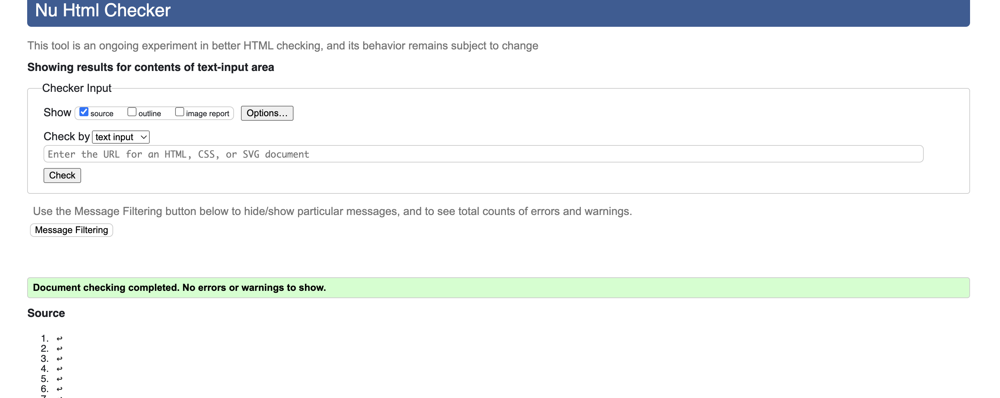
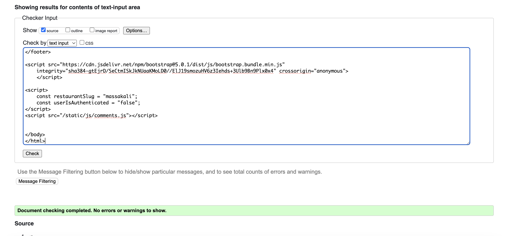
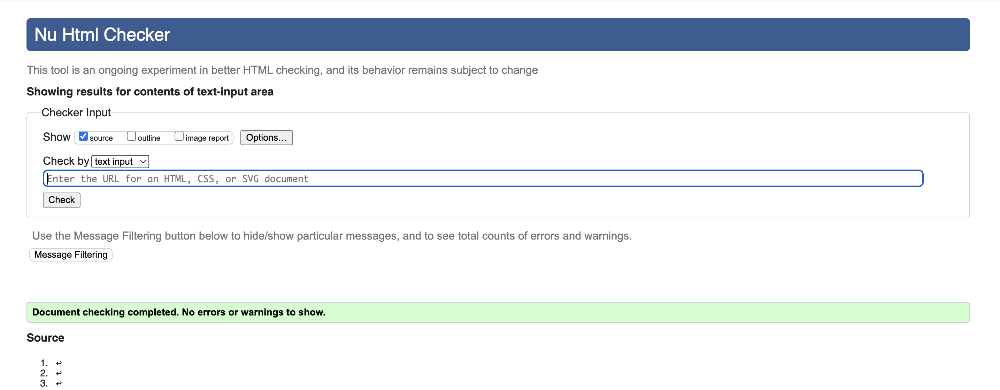
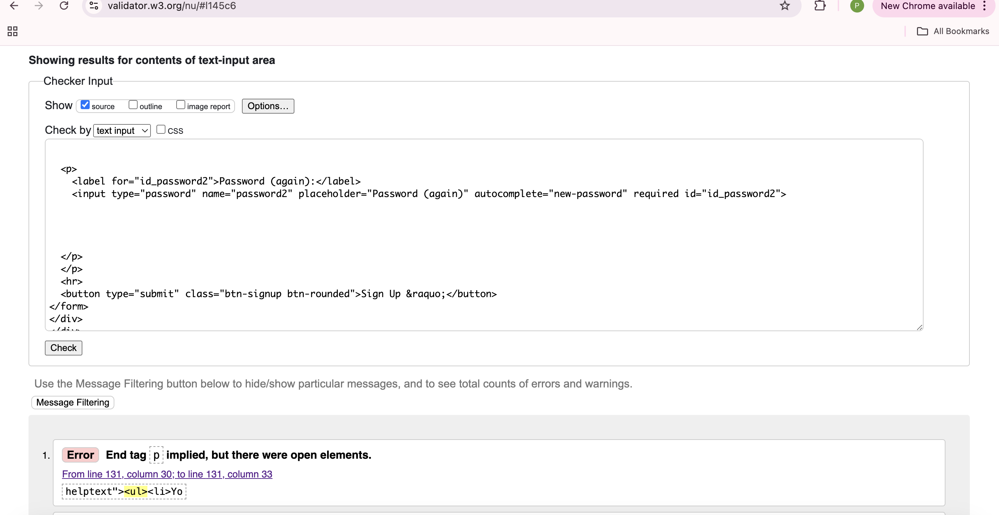
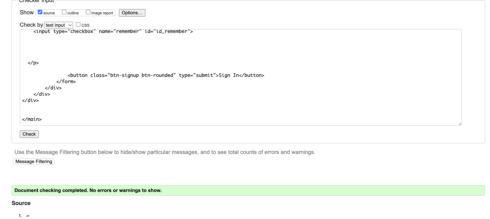
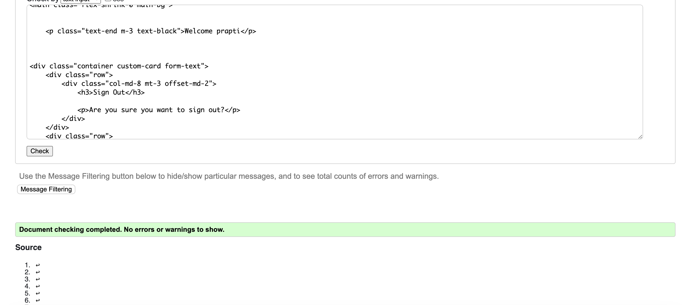
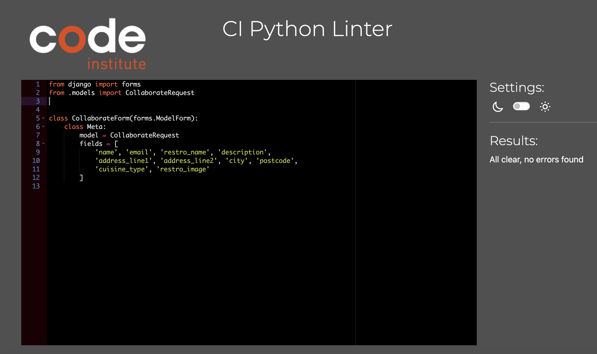

# Testing

- Manual testing was carried out throughout the development of the website and bugs fixed as they arose. 

## Manual testing
- Manual testing was carried out on the local and deployed sites.

## Code validators

### HTML Validator
- The [W3C Validator](https://validator.w3.org/) was used to validate the HTML.

#### Home

#### Chef Page

#### Join Us 

#### Register 

-When I checked the code that the validator was referring to, it was the code which was integrated by Django for the review functionality and not written by me. I looked for it everywhere in an attempt to fix it but could not find it.

#### Sign-In

#### Sign-out

### CSS Validator
- The [W3C CSS Validator](https://jigsaw.w3.org/css-validator/) was used to validate the CSS.

### Python
- The [CI Python Linter](https://pep8ci.herokuapp.com/) was used to validate the Python files.

#### "Restro" project files
All files were edited according to the suggestions provided by the validator and are now showing no errors.

##### asgi.py

##### urls.py

##### wsgi.py

##### settings.py

#### "About" app files
All files were edited according to the suggestions provided by the validator and are now showing no errors.

##### admin.py
 

##### apps.py

##### forms.py

##### models.py

##### urls.py

##### views.py

#### "Review" app files
All files were edited according to the suggestions provided by the validator and are now showing no errors.

##### admin.py

##### apps.py

##### forms.py

##### models.py

##### urls.py

##### views.py

#### Settings.py

-Even though some lines were considered too long by PEP8 (highlighted), I decided that the readability of the code was better when left on the same line, since it was very close to the accepted limit. Even though error exists, the app still functions. 

#### Project urls

## Lighthouse

- The home and detail pages scored low in the best practices. This seemed to be due to the Cloudinary files not producing HTTPS files. Efforts are being made to address this issue to improve the overall score but this is something to be considered as future improvement.

### Desktop Lighthouse

#### Home page

#### Chef page

#### Detail page

#### Join us page

#### Register

#### Sign-in page

### Mobile Lighthouse

#### Home page

#### Chef page

#### Detail page

#### Join us page
